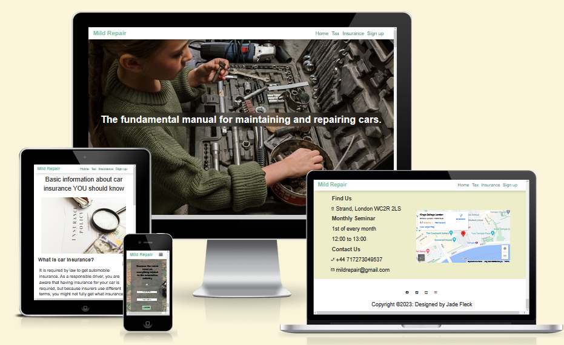
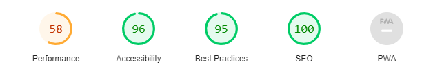

# Mild Repair

This website is intended to target new vehicle owners who may not have much experience with vehicle maintenance and repair. The website will be useful to the target audience by providing them with the knowledge and skills they need to perform basic repairs on their own, which can save them time and money in the long run. Additionally, the website will provide information on tax and insurance, which can help new vehicle owners make informed decisions about their vehicle ownership.

[View live website here](https://jadey1223.github.io/The-fundamental-manual-for-maintaining-and-repairing-cars/).

features
-

* Naviagtion bar
 
    - Featured on all three pages, the full responsive navigation bar includes links to the Home page, Tax, Insurance and Sign Up page and is identical in each page to allow for easy navigation.

    - This section will allow the user to easily navigate from page to page across all devices without having to revert back to the previous page via the ‘back’ button.
    

* The landing page image
    
    - The landing page features a background image with text overlay to show the user that tools are engaged in the context of providing auto maintenance assistance.

    - This section introduces a young female reaching over for a tool giving the user sense that anyone is capable to do the repairs nesseccary.

    

* Repair guide section
    
    -  This section offers a general overview on 
    repairs and maintence on a vehicle.
    -  In this section, the user will be given a step-by-step guide with supporting images and videos to help build their confidence in maintaining their vehicle accordingly.

    <!--  -->
    
* Buying a secondhand car section

    - This section offers a set of questions that one should be asking themself before purchasing a vehicle.
    - In this section these specific question would advise you if the vehicle is worth purchasing or not.
    - This section also acts as a bonus feature to the website.
<!-- 
     -->

* Sign up section

    - In this section, I provide a newsletter to any reader who is interested in hearing about the newest developments in the automobile sector.

    

* Contact Section
    
    - In this section we offer once a month seminar at a specific time and day. We also have intergrated a map so that visitors may find us and our address with ease.
    - We also have Alternative ways of communication via a telephone number or a email address.

    

*  Footer

    - The footer section contains connections to the appropriate social networking sites for mild repairs. The links will open in a new tab for the user's convenience.
    - The user benefits from the footer as it encourages them to stay in touch via social media.

    

* features left to implement

    - 

 ## Testing
 

* ### Validator testing 

    - I have tested my websites on Chrome, Edge , firefox, Safari and confirm that it works.

    - This project looks and fuctions the way i want it to with responsive design for all viewport sizes by using the devtools device tool bar.

    - I confirm that my header section is clear and understandable with working navigaton links to all my different pages in my website.

    - Mobile viewports have a hamburger menu that provides the navigation link to my other pages. This is utilized to take up less surface area on smaller devices.

    - For larger devices, the contact section breakpoint divides the map and contact information into two sections that are positioned next to each other to maximize screen real estate.

    - Viewport for smaller devices at the sign-up area Reduce the amount of space by moving the email and name sections underneath one another.

    - All external links open in a new tab.

    - I can confirm that the forms on my pages are linked to [code institute Form dump](https://formdump.codeinstitute.net).

* HTML   
    - No errors were returned when passing through the official W3C validator.

* CSS
    - No errors were found when passing through the official (Jigsaw) validator.

 * ### Accessibilty

    - I confirm that the colors and font are easy to read and accessible by running it through lighthouse in dev tools.

    - Potential reasons why performance score is so low because of large image files and file formats and embedded links like videos.

    

### Unfixed bugs

- There is no unfixed bugs in my website.

## Credit

* ### Content

    - Favicon was taken from [icon-icons](https://icon-icons.com/download/151981/PNG/32/).

    - Home page sections content was taken from different websites all links with be below.
        - [how to Replace tire.](https://www.theaa.com/breakdown-cover/advice/car-maintenance-tips)
        - [how to Jump starting a vehicle.](https://www.towtruckservicedc.com/how-jump-start-car-step-by-step-guide/)
        - [How to replace a battery.](https://www.driving.co.uk/car-clinic/haynes-how-to/how-change-car-battery/)
        - [How to check your oil level.](https://www.halfords.com/motoring/how-to-guides/check-and-top-up-your-oil-level-guide.html)
        - [How to replace lightbulb.](https://www.halfords.com/motoring/how-to-guides/how-to-change-a-car-headlight-bulb.html)

    - Insurance section content was taken from [Rac](https://www.rac.co.uk/insurance/car-insurance/guides/what-is-car-insurance)
    
    - Tax section content was taken from [ageco](https://www.ageco.co.uk/useful-articles/car/everything-you-need-to-know-about-vehicle-tax-and-insurance/#:~:text=You%20can%20tax%20your%20vehicle,recent%20DVLA%20reminder%20letter%20)

    - Icons was taken from [flaticon](https://www.rac.co.uk/insurance/car-insurance/guides/what-is-car-insurance).

    - [W3C school](https://www.w3schools.com/) was used consecutively.

    - Newsletter section
[Newsletter](https://www.youtube.com/watch?v=hjMKP9Kqkh8)

    - Footer section
[footer links to social media](https://www.youtube.com/watch?v=nkZz9DOBzBI)

    - Responsive header section
[Responsive Navigation menu](https://www.youtube.com/watch?v=yE9DLIoDwCg)

* ### Media 

    - Tax and insurance section have royalty free images from [pexels](https://www.pexels.com/).
    - Home page 
        - jump start image was used from [honkforhelp](https://www.honkforhelp.com/explore/2016/printable-jumpstart-guide/)
        - Oil level image was used from [autodeal](https://www.autodeal.com.ph/articles/car-features/how-check-your-cars-oil-level)

