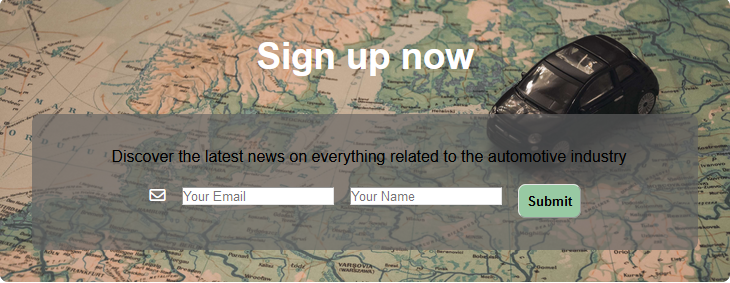

#The fundamental manual for maintaining and repairing cars.

features
-

* Naviagtion bar
 
    - Featured on all three pages, the full responsive navigation bar includes links to the Home page, Tax, Insurance and Sign Up page and is identical in each page to allow for easy navigation.

    - This section will allow the user to easily navigate from page to page across all devices without having to revert back to the previous page via the ‘back’ button.
    

* The landing page image
    
    - The landing page features a background image with text overlay to show the user that tools are engaged in the context of providing auto maintenance assistance.

    - This section introduces a young female reaching over for a tool giving the user sense that anyone is capable to do the repairs nesseccary.

    

* Repair guide section
    
    -  This section offers a general overview on 
    repairs and maintence on a vehicle.
    -  In this section, the user will be given a step-by-step guide with supporting images and videos to help build their confidence in maintaining their vehicle accordingly.

    
    
* Buying a secondhand car section

    - This section offers a set of questions that one should be asking themself before purchasing a vehicle.
    - In this section these specific question would advise you if the vehicle is worth purchasing or not.
    - This section also acts as a bonus feature to the website.

    

* Sign up section

    - In this section, I provide a newsletter to any reader who is interested in hearing about the newest developments in the automobile sector.

    

* Contact Section
    
    - In this section we offer once a month seminar at a specific time and day. We also have intergrated a map so that visitors may find us and our address with ease.
    - We also have Alternative ways of communication via a telephone number or a email address.

    

* 

